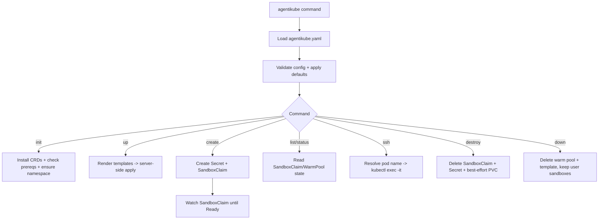
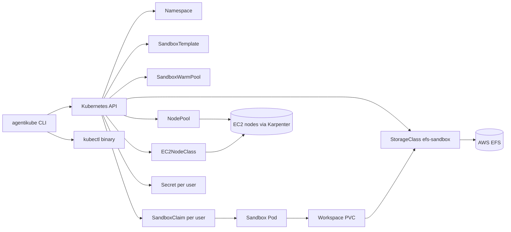

# agentikube
[](https://github.com/harivansh-afk/agentikube/blob/main/go.mod)
[](https://github.com/harivansh-afk/agentikube)
[](https://github.com/harivansh-afk/agentikube/actions/workflows/release.yml)

This repo is a small Go CLI for running isolated agent sandboxes on Kubernetes.

The main job of `agentikube` is:
- set up shared sandbox infra (`init`, `up`)
- create one sandbox per user/handle (`create`)
- let you inspect and access sandboxes (`list`, `status`, `ssh`)
- clean up sandboxes or shared infra (`destroy`, `down`)

It is built for AWS-style setups (EFS + optional Karpenter).

## What This Stands Up

When you run `up`, it renders and applies Kubernetes manifests from templates.

Core resources:
- `Namespace`
- `StorageClass` (`efs-sandbox`, provisioner `efs.csi.aws.com`)
- `SandboxTemplate` (`sandbox-template`)

Optional resources:
- `SandboxWarmPool` (if `sandbox.warmPool.enabled: true`)
- `NodePool` + `EC2NodeClass` (if `compute.type: karpenter`)

When you run `create <handle>`, it creates:
- `Secret` (`sandbox-<handle>`) with provider credentials
- `SandboxClaim` (`sandbox-<handle>`) that points to `sandbox-template`
- PVC from template (`workspace` volume claim template)

## Filesystem

```text
cmd/agentikube/main.go         # CLI entrypoint + subcommand wiring
internal/config/               # config structs + validation/defaults
internal/manifest/             # template rendering
internal/manifest/templates/   # Kubernetes YAML templates
internal/kube/                 # kube client, apply, wait, exec helpers
internal/commands/             # command implementations
agentikube.example.yaml        # example config you copy to agentikube.yaml
Makefile                       # build/install/fmt/vet targets
```

## How It Works (Simple Flow)



## Resource Diagram (Abilities + Resources)



## Commands

- `agentikube init`  
  Installs agent-sandbox CRDs, checks for EFS CSI/Karpenter, and ensures namespace exists.
- `agentikube up [--dry-run]`  
  Renders manifests and applies them with server-side apply. `--dry-run` prints YAML only.
- `agentikube create <handle> --provider <name> --api-key <key>`  
  Creates per-user Secret + SandboxClaim and waits (up to 3 minutes) for Ready.
- `agentikube list`  
  Shows handle, status, age, and pod name for all sandbox claims.
- `agentikube ssh <handle>`  
  Finds the sandbox pod and opens `/bin/sh` using `kubectl exec -it`.
- `agentikube destroy <handle> [--yes]`  
  Deletes SandboxClaim + Secret + best-effort PVC for that handle.
- `agentikube down`  
  Deletes shared warm pool/template infra but preserves existing user sandboxes.
- `agentikube status`  
  Prints warm pool numbers, sandbox count, and Karpenter node count (if enabled).

## Quick Start

1. Copy config:

```bash
cp agentikube.example.yaml agentikube.yaml
```

2. Fill your values in `agentikube.yaml`:
- namespace
- EFS filesystem ID / base path
- sandbox image
- compute settings

3. Run:

```bash
agentikube init
agentikube up
agentikube create demo --provider openai --api-key <key>
agentikube list
agentikube ssh demo
```

## Test CLI Locally

Use this exact flow to verify the CLI on your machine:

```bash
# 1) Build + tests
mkdir -p .cache/go-build .cache/go-mod
GOCACHE=$(pwd)/.cache/go-build GOMODCACHE=$(pwd)/.cache/go-mod go build ./...
GOCACHE=$(pwd)/.cache/go-build GOMODCACHE=$(pwd)/.cache/go-mod go test ./...

# 2) Root help + command help
GOCACHE=$(pwd)/.cache/go-build GOMODCACHE=$(pwd)/.cache/go-mod go run ./cmd/agentikube --help
for c in init up create list ssh down destroy status; do
  GOCACHE=$(pwd)/.cache/go-build GOMODCACHE=$(pwd)/.cache/go-mod go run ./cmd/agentikube "$c" --help >/dev/null
done

# 3) Manifest generation smoke test
./agentikube up --dry-run --config agentikube.example.yaml
```

If those pass, the CLI wiring + config + templating path is working locally.

## CI And Auto Release

This repo now has two GitHub Actions workflows:
- `.github/workflows/ci.yml`  
  Runs `go build ./...` and `go test ./...` on PRs and non-main branch pushes.
- `.github/workflows/release.yml`  
  Runs on push to `main`, auto-bumps patch version (`vX.Y.Z`), writes `VERSION`, creates/pushes tag, builds multi-platform binaries, and creates a GitHub Release with artifacts.

## Notes / Current Limits

- `storage.type` currently must be `efs`.
- `kubectl` must be installed (used by `init` and `ssh`).
- `compute.type: fargate` is validated, but this repo currently renders templates for the Karpenter path.
- No Go tests are present yet (`go test ./...` reports no test files).
